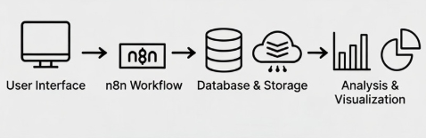
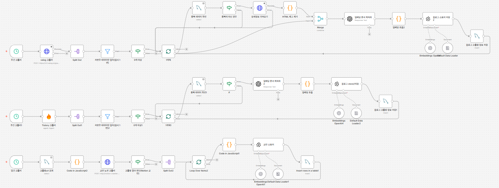
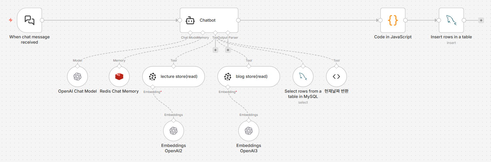
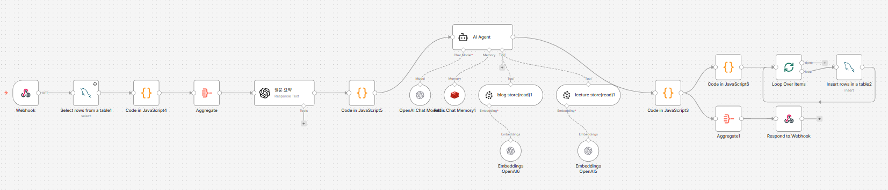
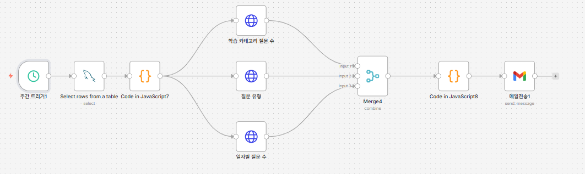
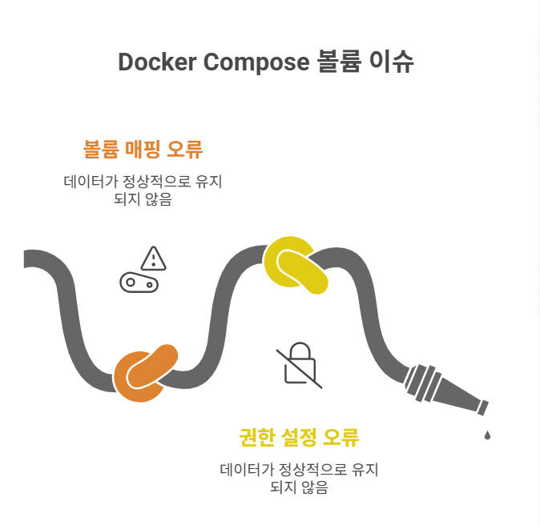
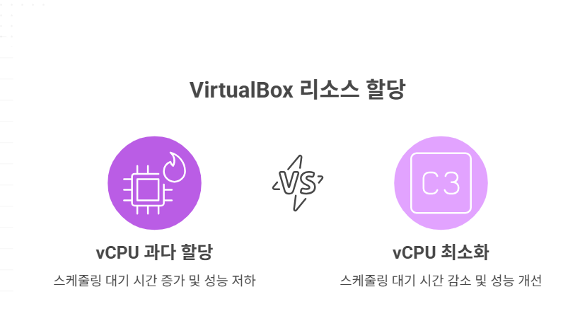

# AI-Driven Learning Assistant Platform


## 📖 Project Overview


학습·업무 과정에서 발생하는 지식 휘발과 반복 질문을 줄이기 위한 **RAG 기반 학습/지식 지원 솔루션입니다.**  

Notion, Blog 등 비정형 자료를 벡터화해 질의에 근거 기반 답변을 제공하고, **n8n으로 크롤링–정제–적재–스케줄 실행 등 데이터 파이프라인을 자동화**하여 운영 효율을 높였습니다.
또한 ELK Stack으로 사용 로그를 수집·분석해 **이해도와 병목 구간을 데이터로 가시화**하고, 개인 사용자부터 팀 단위 운영까지 확장 가능한 형태로 설계되었습니다.
</div>

---


## 👨‍👩‍👧 팀원 소개

|                                                                         |                                                                    |                                                                         |
| :---------------------------------------------------------------------: | :----------------------------------------------------------------: | :---------------------------------------------------------------------: |
|  |  |  |
|               [**손정원**](https://github.com/handgarden)               |            [**이동욱**](https://github.com/cuterrabbit)            |                 [**이승준**](https://github.com/HiLeeS)                 |

## 📖 프로젝트 소개

### 🧩 문제 인식: 지식은 쌓이는데, ‘필요한 순간’에 꺼내 쓰기 어렵다

교육/업무 환경에서는 문서·공지·블로그·위키·이슈 트래커 등 **지식이 여러 채널에 분산**되고, 시간이 지나며 **맥락(버전·정책·환경)이 바뀌는** 일이 흔합니다.  
그 결과 “알고 있었는데 지금 당장 못 찾겠다”가 반복되고, 운영 측면에서도 “무엇이 막히는지”를 정량적으로 보기 어렵습니다.

---

#### 사용자(학습자·실무자) 관점의 Pain Point
- **찾는 데 시간이 듦**: 예전에 봤던 명령어/설정/가이드를 다시 찾느라 맥이 끊김  
- **자료가 흩어짐**: Notion·블로그·공지·PR/이슈·드라이브가 따로 놀아서 검색 효율이 낮음  
- **최신성/정합성 불안**: 업데이트가 잦아 “이게 지금 기준 맞나?”를 매번 확인해야 함  
- **일반 답변의 한계**: LLM 답이 우리 조직/프로젝트 규칙·도구·환경과 달라 적용 단계에서 혼란 발생

---

#### 운영자(강사·팀 리드·운영진) 관점의 Pain Point
- **막히는 지점이 안 보임**: 어떤 주제가 반복 질문인지, 어디서 많이 헤매는지 감으로만 판단  
- **반복 대응 비용 증가**: 유사 질문이 계속 쌓이지만 표준 답변/근거 링크/대응 흐름이 정리돼 있지 않음  
- **콘텐츠가 누적될수록 운영 부담↑**: 자료는 늘어나는데 활용 품질은 오히려 떨어짐  
- **지표 부재**: 질문 유형·검색 성공률·참조 문서·활용 추이 같은 데이터가 없어 개선을 설계하기 어려움 📊


---

### 🎯 솔루션: 조직/과정 맞춤형 지식 AI 어시스턴트

분산된 자료(Notion·블로그·문서·공지·이슈 등)를 **RAG 파이프라인**으로 연결하고, 사용자의 질의/활용 로그를 **n8n으로 자동화 수집·처리**하여 **답변 품질 + 운영 인사이트**를 동시에 제공합니다.

---

#### 사용자에게는: 필요한 순간에 “근거까지” 찾아주는 24/7 어시스턴트

**✅ 맥락 기반 맞춤 답변**
- “지난번에 쓴 Docker 명령어 뭐였지?” → 해당 자료/포스트/문서에서 근거를 찾아 **우리 기준**으로 답변
- “이번 주 일정/마감은?” → 스케줄 DB·공지 데이터와 연동해 **최신 정보**로 안내
- “Spring Boot 설정 다시 알려줘” → 과정/팀에서 실제 사용하는 구성과 예제를 기준으로 설명

**✅ 검색·정리 비용 절감**x
- 관련 문서/페이지 **자동 링크 제공**
- 개인/팀 학습 기록(Velog/Tistory 등)도 함께 참고해 **현장감 있는 맥락** 유지
- 범용 답변이 아니라, **내가 속한 환경에서 바로 적용 가능한 형태**로 정리

---

#### 운영자에게는: 데이터로 학습/업무 흐름을 개선하는 인사이트 대시보드

**✅ 흐름과 병목의 가시화**
- 질문/요청 유형 추이: 특정 주제 급증 → 보충 설명/가이드 업데이트 신호
- 자주 막히는 구간(핫 토픽) 탐지 → 실습/문서/템플릿 보강 포인트 도출
- 주제별 관심도·변화 추이: Java/Spring/Docker/AWS 등 카테고리별 트렌드 확인

**✅ 자동화된 운영 루프**
- n8n으로 크롤링·정제·저장·리포팅을 자동화하여 **반복 운영 작업 최소화**
- 주간 요약 리포트(질문 유형/상위 주제/참조 자료/변화 추이) 자동 생성·전송
- **ELK Stack 기반 실시간 대시보드**로 로그를 시각화해, 개선 효과를 빠르게 검증


---

## 🌟 주요 기능

### 1. 📊 자동 크롤링 시스템

#### 주간 크롤링 (매주 월요일 01:00)
- 🔍 **Velog 검색**: "우리FISA 클라우드 엔지니어링" 키워드
- 🔍 **Tistory 크롤링**: Firecrawl API 활용
- 📅 **필터링**: 최근 1년 이내 게시물만 수집
- 🤖 **임베딩 최적화**: GPT-4.1-mini로 학습 맥락 구조화
- 💾 **저장**: Pinecone Vector DB (woorifisa-blogs)

#### 일간 크롤링 (매일 자동 실행)
- 📖 **Notion 강의 자료 크롤링**
  - 커스텀 Notion Crawler (Node.js) 사용
  - 이미 크롤링한 URL 제외 (중복 방지)
- 💾 **저장**: Pinecone Vector DB (woorifisa-lectures)

---

### 2. 🤖 AI 챗봇 (RAG 기반)

**지능형 질문 응답 시스템**
- **질문 유형 자동 분류**: 일정 질문 / 수업 내용 질문 / 일반 질문
- **학습 카테고리 태깅**: Java, Spring, Docker, Kubernetes, Linux, Cloud, AWS, n8n, ELK
- **다층 검색 전략**:
  1. 📅 현재 날짜/시간 확인 (Redis MCP Tool)
  2. 📝 학습 블로그 검색 (Velog/Tistory 크롤링 데이터)
  3. 📊 수업 일정 조회 (MySQL)
  4. 📚 강의 자료 검색 (Notion 크롤링 데이터)
  5. 🌐 웹 검색 보완 (OpenAI Search Tool)

**답변 구조**
```
1. 질문 유형: [일정 질문 / 수업 내용 질문 / 일반 질문]
2. 답변: [맥락 기반 상세 답변]
3. 학습 카테고리: [해당 카테고리]
4. 일정: [MySQL 기반 스케줄 정보]
5. 수업 자료: [Notion 강의 자료 링크]
6. 블로그 자료: [Velog/Tistory 학습 후기 링크]
```
---

### 3. 🎯 자동 퀴즈 생성 시스템

**주간 학습 기반 퀴즈 자동 생성**
- 📚 **데이터 수집**: 최근 20개 채팅 히스토리 분석
- 🧠 **AI 요약**: GPT-4.1-mini로 핵심 주제 추출
  - Core Topics (3개)
  - Key Keywords (5-7개)
  - Technical Summary (2문장)
- 🎲 **퀴즈 구성**:
  - Q1: 객관식 (4지선다) - 핵심 이론
  - Q2: 주관식 - 구체적 도구/명령어/용어
  - Q3: OX - 실전 시나리오

**중복 방지 메커니즘**
- Redis Chat Memory로 이전 퀴즈 히스토리 추적
- 같은 주제라도 다른 시나리오/관점으로 출제
- 시스템 프롬프트에 명시적 중복 방지 규칙 적용

---

### 4. 📧 주간 학습 리포트

**자동 생성 및 전송 (매주)**
- 📊 **3가지 시각화 그래프**:
  1. 질문 유형 파이차트 (일정/수업/일반)
  2. 학습 카테고리 막대그래프 (Java/Spring/Docker 등)
  3. 일자별 질문 수 라인그래프
- 📝 **Google Docs 리포트 생성**
  - 그래프 이미지 Google Drive 업로드
  - 자동으로 문서에 삽입
- 📧 **Gmail 자동 발송**

---

### 5. 📊 ELK Stack 기반 실시간 데이터 시각화

**Elasticsearch + Logstash + Kibana를 활용한 학습 분석 대시보드**

#### 데이터 수집 파이프라인
```
n8n Chatbot → MySQL → Logstash → Elasticsearch → Kibana
```

#### Logstash 설정 (실시간 MySQL 데이터 수집)
```ruby
# logstash/pipeline/mysql-chat-histories.conf
input {
  jdbc {
    jdbc_driver_library => "/usr/share/logstash/mysql-connector.jar"
    jdbc_driver_class => "com.mysql.cj.jdbc.Driver"
    jdbc_connection_string => "jdbc:mysql://n8n_mysql:3306/woorifisa"
    jdbc_user => "root"
    jdbc_password => "${MYSQL_ROOT_PASSWORD}"
    schedule => "*/5 * * * *"  # 5분마다 실행
    statement => "
      SELECT 
        id, question_type, learning_category, 
        general_answer, created_at
      FROM fisa_chat_histories
      WHERE created_at > :sql_last_value
      ORDER BY created_at ASC
    "
    use_column_value => true
    tracking_column => "created_at"
  }
}

output {
  elasticsearch {
    hosts => ["n8n_elasticsearch:9200"]
    index => "woorifisa-chat-histories-%{+YYYY.MM.dd}"
    user => "elastic"
    password => "${ELASTIC_PASSWORD}"
  }
}
```

#### Kibana 대시보드 구성 (`http://localhost:5601`)

**1. 학습 카테고리 분석**
- 📊 **파이차트**: 카테고리별 질문 비율 (Java/Spring/Docker/AWS/Kubernetes 등)
- 📈 **시계열 그래프**: 일/주/월별 카테고리 트렌드
- 🔥 **히트맵**: 시간대별 질문 집중도

**2. 질문 유형 분석**
- 📊 **도넛차트**: 일정/수업/일반 질문 비율
- 📊 **세로 막대그래프**: 주차별 질문 유형 변화

**3. 실시간 모니터링**
- ⚡ **Metric 시각화**:
  - 오늘 총 질문 수
  - 이번 주 평균 응답 시간
  - 가장 많이 검색된 키워드 (Top 10)
- 📊 **타임라인**: 실시간 질문 스트림

**4. 학습 성과 분석**
- 📈 **라인차트**: 주차별 누적 질문 수 (학습 참여도 지표)
- 📊 **영역 차트**: 카테고리별 학습 진행 상황
- 🎯 **게이지 차트**: 주간 목표 달성률


## 🏗 System Architecture

#### 1. Custom Crawler & ETL Pipeline (Express + FireCrawl)

- **Architecture**: Notion API의 Rate Limit 및 블록 렌더링 제약을 우회하기 위해 Headless Browser 기반의 커스텀 크롤러 구현.
- **Function**: Notion, Tistory, Velog 등 이기종 플랫폼에 분산된 기술 문서의 DOM을 파싱하고, 마크다운 형태로 정규화(Normalization)하여 학습 데이터셋 구축.

#### 2. RAG Engine (n8n + OpenAI + Pinecone)

- **Vector Search**: Pinecone Vector DB를 활용하여 수강생 질문과 가장 유사도(Cosine Similarity)가 높은 커리큘럼 컨텍스트를 실시간 조회.

#### 3. Quiz Generator

- **Workflow**: 학습자의 누적 질의 키워드와 수집한 문서를 매핑하여 개인화된 퀴즈 문항 자동 생성 (Webhook Trigger).
- **Data Persistence**: 퀴즈 수행 결과를 MySQL에 적재하여 학습 성취도 추적.

#### 4. Analytics Dashboard (ELK Stack)

- **Log Aggregation**: Logstash 파이프라인을 통해 MySQL의 질의/퀴즈 로그를 실시간 수집.
- **Visualization**: Elasticsearch 인덱싱 및 Kibana 대시보드를 통해 '질문 빈도 히트맵', '이해도 추이', '취약 토픽 분석' 등 인사이트 시각화.

#### 5. Automated Reporting Service

- **Batch Processing**: 주간 단위 트리거를 통해 학습 로그 집계 및 QuickChart API 기반의 시각화 객체 생성.
- **Delivery**: 수강생별 맞춤형 주간 리포트 이메일 자동 발송 시스템 구축.

```
┌─────────────────────────────────────────────────────────────────┐
│                         사용자 인터페이스                        │
│              (React Frontend / Slack / Web Chat / API)          │
└─────────────────────────────────────────────────────────────────┘
                                ↓
┌─────────────────────────────────────────────────────────────────┐
│                          n8n Workflow                           │
│  ┌──────────────┐  ┌──────────────┐  ┌──────────────┐           │
│  │ 챗봇 에이전트│  │ 크롤링 스케줄러│ │  퀴즈 생성기  │          │
│  │   (GPT-4.1)  │  │   (주간/일간) │ │ (GPT-4.1-mini)│          │
│  └──────────────┘  └──────────────┘  └──────────────┘           │
└─────────────────────────────────────────────────────────────────┘
                ↓               ↓               ↓
┌───────────────────┐ ┌─────────────────┐ ┌──────────────────┐
│  Pinecone VectorDB│ │     MySQL       │ │   Redis Memory   │
│  ┌─────────────┐  │ │  ┌───────────┐  │ │  ┌────────────┐  │
│  │   blogs     │  │ │  │ schedules │  │ │  │ chat_memory│  │
│  │  (블로그)   │  │ │  │ (일정)    │  │ │  │ (대화기록)  │  │
│  ├─────────────┤  │ │  ├───────────┤  │ │  └────────────┘  │
│  │  lectures   │  │ │  │ histories │←─┼─┼─────┐            │
│  │  (강의자료) │  │ │  │ (채팅기록)│  │ │     │            │
│  └─────────────┘  │ │  ├───────────┤  │ │     │            │
│                   │ │  │   quiz    │  │ │     │            │
│                   │ │  │ (퀴즈문제)│  │ │     │            │
│                   │ │  └───────────┘  │ │     │            │
└───────────────────┘ └─────────────────┘ └─────┼────────────┘
                                ↓               │
                    ┌───────────────────────────┘
                    │
                    ↓
┌─────────────────────────────────────────────────────────────────┐
│                       ELK Stack (분석/시각화)                   │
│  ┌──────────────────────────────────────────────────────────┐   │
│  │                       Logstash                           │   │
│  │  • MySQL JDBC Input (5분마다)                            │   │
│  │  • 데이터 파싱 및 전처리                                 │   │
│  └──────────────┬───────────────────────────────────────────┘   │
│                 ↓                                               │
│  ┌──────────────────────────────────────────────────────────┐   │
│  │                    Elasticsearch                         │   │
│  │  • Index: woorifisa-chat-histories-YYYY.MM.dd            │   │
│  │  • 실시간 검색 및 집계                                   │   │
│  └──────────────┬───────────────────────────────────────────┘   │
│                 ↓                                               │
│  ┌──────────────────────────────────────────────────────────┐   │
│  │                       Kibana                             │   │
│  │  📊 학습 카테고리 분석 (파이차트)                        │   │
│  │  📈 질문 유형 트렌드 (시계열 그래프)                     │   │
│  │  🔥 실시간 질문 모니터링 (메트릭)                        │   │
│  │  🎯 주간/월간 학습 성과 대시보드                         │   │
│  └──────────────────────────────────────────────────────────┘   │
└─────────────────────────────────────────────────────────────────┘
                                ↓
┌─────────────────────────────────────────────────────────────────┐
│                        외부 서비스 연동                          │
│   Velog API | Tistory | Notion Crawler | Google Docs | Gmail    │
└─────────────────────────────────────────────────────────────────┘
```

## 🛠 Tech Stack

| 구분          | 기술                                                                                                                                                                                                                                                           | 비고                            |
| ------------- | -------------------------------------------------------------------------------------------------------------------------------------------------------------------------------------------------------------------------------------------------------------- | ------------------------------- |
| **Backend**   |                                                                                            | 워크플로우 자동화 및 크롤링     |
| **Frontend**  |                                                                                                                                                                        | 채팅 및 퀴즈 인터페이스         |
| **AI / LLM**  |                                                                                                                                                                            | GPT / Embedding                 |
| **Database**  |    | 벡터 검색 / RDBMS / 캐시·메모리 |
| **Analytics** |                                                                                                                                                                  | 로그 수집·검색·시각화           |
| **DevOps**    |                                                                                                                                                                            | 컨테이너 배포                   |

## 🔧 Technical Issues & Solutions

### 1. Data Persistence & Volume Mapping Strateg



- **Issue**: Docker Compose 볼륨 재생성 이슈.
- **Analysis**: 호스트-컨테이너 간 볼륨 마운트 경로 설정 미흡.
- **Solution**: 기존 볼륨을 백업 후 새 볼륨으로 복원하는 방법으로 데이터 복원.

### 2. Virtualization Resource Scheduling Optimization



- **Issue**: 리소스 증설(Scale-up) 후 오히려 응답 지연(Latency)이 증가하는 역설적 성능 저하 발생.
- **Analysis**: 호스트 자원 대비 과도한 vCPU 할당으로 인한 **Co-Scheduling Overhead** 및 **CPU Ready Time** 급증 확인.
- **Solution**: vCPU 할당량을 최소화하여 해결.

---

## 📂 Directory Structure

```text
.
├── frontend/          # Next.js Client Application
├── backend/           # n8n Workflows & Configuration
├── crawler/           # Custom Scraper (Express, Puppeteer/FireCrawl)
├── db/                # MySQL Schema & Init Scripts
├── elk/               # Logstash Pipeline & ELK Config
├── docker/            # Docker Compose & Environment Setup
└── assets/            # Documentation Resources

```

---

## 📬 설치 및 실행

**1. Clone Repository**

```bash
git clone https://github.com/your-repo/ai-learning-helper.git
cd ai-learning-helper

```

**2. Setup Environment Configuration**

```bash
# Set Notion Target URL & API Keys
echo "NOTION_URL={{TARGET_URL}}" > ./crawler/.env

```

**3. Build & Run Containers**

```bash
docker-compose up -d --build

```

**4. 서비스 주소**

- **웹**: `http://localhost:4000`
- **N8N**: `http://localhost:5678`
- **Kibana**: `http://localhost:5601`

---
