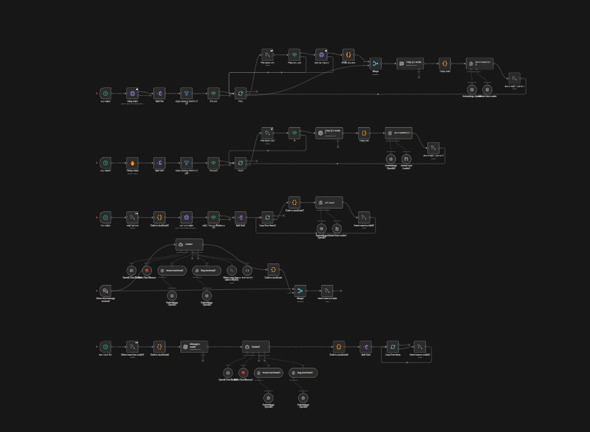
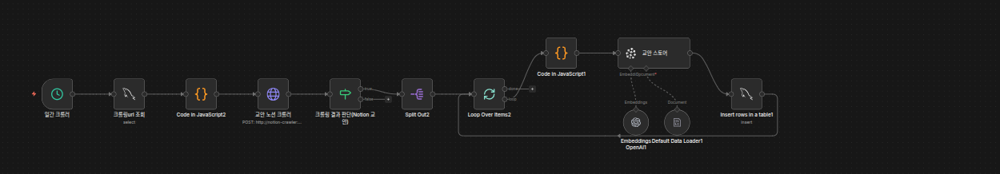
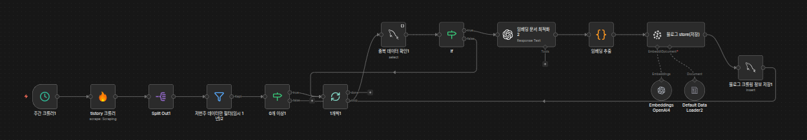
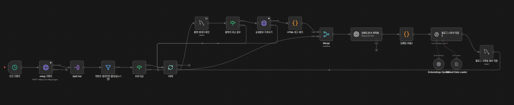
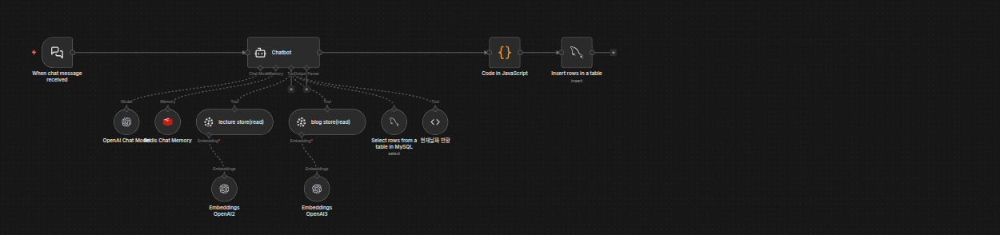
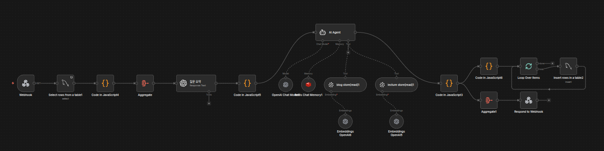
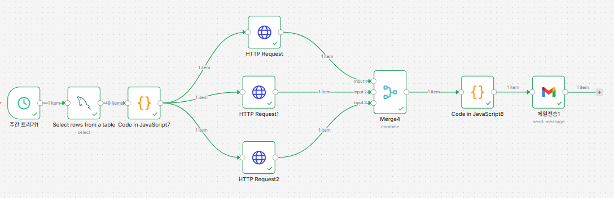

# AI 학습 도우미 (n8n Workflow)


## 📖 프로젝트 개요

**"그 리눅스 명령어 뭐였지?"** 수업을 듣고도 뒤돌아서면 까먹는 학생들과, 학생들이 진짜 이해했는지 궁금한 강사님들을 위한 **RAG(검색 증강 생성) 기반 학습 보조 솔루션**입니다.


## 👨‍👩‍👧 팀원 소개

|                                                                         |                                                                    |                                                                         |
| :---------------------------------------------------------------------: | :----------------------------------------------------------------: | :---------------------------------------------------------------------: |
|  |  |  |
|               [**손정원**](https://github.com/handgarden)               |            [**이동욱**](https://github.com/cuterrabbit)            |                 [**이승준**](https://github.com/HiLeeS)                 |

---

### 🎯 기획 의도

* **학생 입장**: GPT나 Gemini 같은 LLM이 내 수업 진도와 자료를 알고 있다면? "그때 배운 가상머신 설정법 알려줘"라고 물었을 때, 수업 자료를 바탕으로 정확한 답변을 제공하여 학습 효율을 극대화합니다.
* **강사/매니저 입장**: "다들 이해하셨죠?"라는 질문에 침묵으로 일관하는 학생들. 챗봇 로그와 퀴즈 데이터를 통해 학생들의 이해도를 객관적인 지표로 시각화하고 관리합니다.

---

## 🏗 시스템 아키텍처

### 전체 데이터 흐름




### 주요 구성 요소

1. **Crawler (Express + FireCrawl)**
- 노션 

- 티스토리

- 벨로그

* Notion API의 제약을 극복하기 위한 커스텀 크롤러
* Tistory, Velog 등 기술 블로그의 주차별 진도 및 핵심 내용 수집

2. **AI Chatbot (n8n + OpenAI)**

* **RAG 적용**: VectorDB(Pinecone)와 MySQL에 저장된 수업 데이터를 참조하여 답변
* **Chat Memory**: 이전 대화 문맥을 유지하며 자연스러운 질의응답 처리


3. **Quiz System**

* 학생의 질문 기록과 현재 진도 데이터를 바탕으로 맞춤형 퀴즈 자동 생성
* 풀이 결과는 즉시 MySQL에 저장되어 성취도 분석에 활용


4. **Analytics Dashboard (ELK Stack)**
* **Logstash**: MySQL에 적재된 채팅/퀴즈 로그 수집
* **Elasticsearch & Kibana**: 학생별 질문 빈도, 퀴즈 정답률, 이해도 추이를 시각화


5. **Weekly Email Report**

* **QuickChart API** (Chart.js config → PNG) 를 호출해 3개의 차트 이미지를 생성
* 주간 트리거로 MySQL에 저장된 질문 로그를 집계하고, 학습카테고리/질문유형/일자별 통계를 생성 및 이메일 발송


---

## 🛠 기술 스택 (Tech Stack)

| 구분 | 기술 | 비고 |
| --- | --- | --- |
| **Backend** |   | 워크플로우 자동화 및 크롤링 |
| **Frontend** |  | 채팅 및 퀴즈 인터페이스 |
| **AI / LLM** |  | GPT / Embedding |
| **Database** |    | 벡터 검색 / RDBMS / 캐시·메모리 |
| **Analytics** |  | 로그 수집·검색·시각화 |
| **DevOps** |  | 컨테이너 배포 |


---

## 📸 주요 기능 및 화면

| 채팅 화면 | 퀴즈 화면 |
| --- | --- |
|  |  |
| **n8n 연동 실시간 질의응답** | **Webhook 기반 퀴즈 생성** |

| 채팅 대시보드 | 퀴즈 대시보드 |
| --- | --- |
|  |  |
| **질문 키워드 및 빈도 분석** | **학습 성취도 시각화** |

---

## 📂 프로젝트 구조 (Directory Structure)

```
.
├── frontend/          # Next.js 기반 채팅 & 퀴즈 클라이언트
├── backend/           # n8n 워크플로우 JSON 및 설정 파일
├── crawler/           # Express 기반 수업 자료 크롤러
├── db/                # MySQL 초기화 스크립트 및 스키마
├── elk/               # Logstash, Elasticsearch, Kibana 설정
├── docker/            # Docker Compose 및 환경 설정
└── assets/            # 문서용 이미지 리소스

```

---

## 📬 설치 및 실행 (Getting Started)

**Prerequisites**

* Docker & Docker Compose

**1. 레포지토리 클론**

```bash
git clone https://github.com/your-repo/ai-learning-helper.git
cd ai-learning-helper
```

**2. 교안 Notion URL 설정**
```
echo "NOTION_URL={{https:example.com}}" > ./notion-crawler/.env
```

**2. 컨테이너 실행**

```bash
docker-compose up -d

```

**3. 서비스 접속**

* **Web**: `http://localhost:4000`
* **N8N**: `http://localhost:5678`
* **Kibana (Dashboard)**: `http://localhost:5601`

**4. N8N credentials 설정**
* 메뉴얼: `[메뉴얼](./docs/manual.md)`

---

## 🔧 트러블슈팅 (Troubleshooting)

### 1. **Docker Compose 볼륨 이슈**

* **증상**: 컨테이너 재실행 시 DB 데이터 초기화
* **원인**: 볼륨 매핑 경로 및 권한 설정 오류로 데이터가 정상적으로 유지되지 않음
* **해결**: 호스트 볼륨 권한 수정 및 `docker-compose.yml` 내 볼륨 설정 재확인
  (기존 볼륨 백업 후 초기화, 원본 데이터 복원 방식 적용)

### 2. **VirtualBox 리소스 할당 문제**

* **증상**: 리소스 부족으로 CPU·메모리 증설 후 오히려 성능 저하
* **원인**: vCPU 과다 할당으로 Co-Scheduling 오버헤드 발생 → CPU Ready Time 증가
* **해결**: vCPU 수를 최소화하여 스케줄링 대기 시간 감소 및 성능 개선

### 3. **Notion API 사용 불가**

* 제공된 교안 URL로 Notion API 접근 불가
* FireCrawl 무료 플랜 크롤링 제한
* **대응**: 외부 API 사용 대신 기능 직접 구현

---

## 🚀 향후 계획 (Roadmap)

* **이벤트 기반 알림 시스템**: 특정 주제에 대한 질문이 폭주할 경우 강사에게 즉시 슬랙/이메일 알림 발송
* **배포 자동화**: Docker Compose setup 스크립트에 Kibana 대시보드 Import 과정 포함
