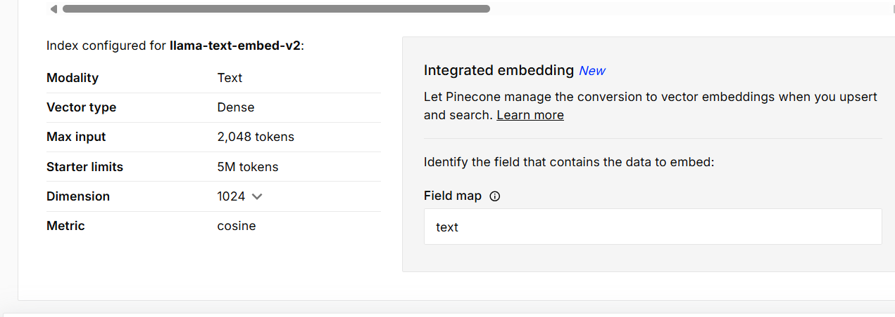
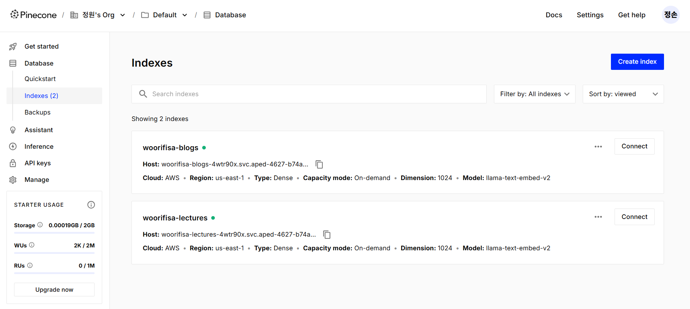
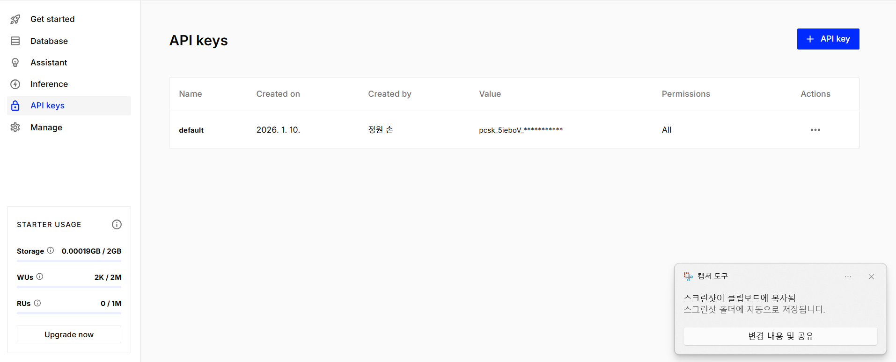
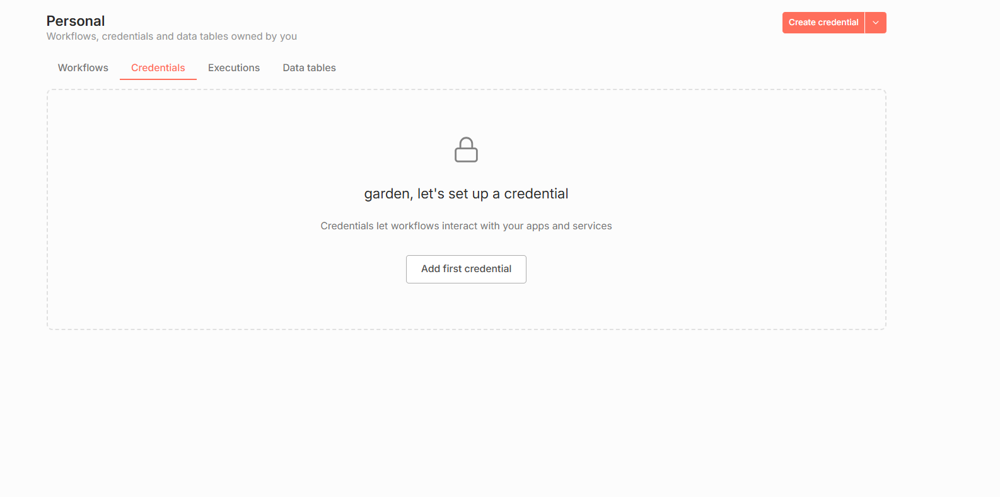
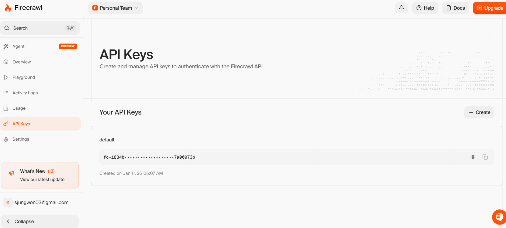
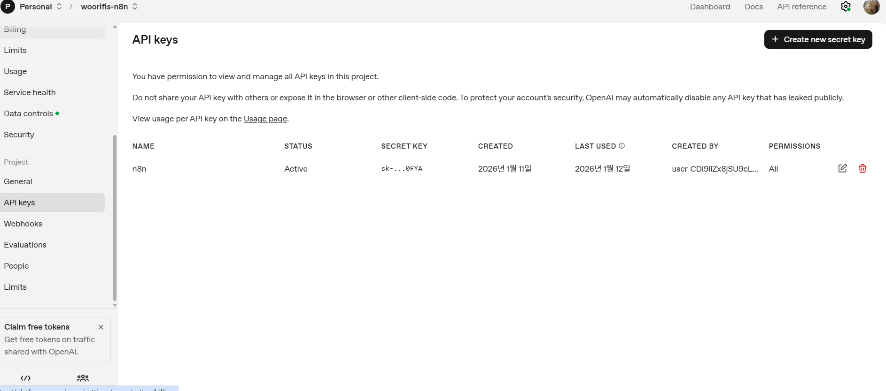

# 설치 메뉴얼

## 교안 크롤러 URL 설정

- `notion-crawler` 디렉토리에 `.env` 파일 생성
- NOTION_URL 환경변수 설정:
  ```bash
  # notion-crawler/.env
  NOTION_URL=https://your-notion-published-page-url
  ```

## Docker compose 실행

- 현재 프로젝트에서 Terminal 생성
- docker-compose up -d --build 명령어 실행
  - compose가 없는 경우 추천 명령어 확인해서 설치

## n8n 초기 설정

- http://localhost:5678 접속
- 회원가입 및 설정 진행
  - 실제 사용하는 이메일로 설정
  - 이메일 쿠폰 확인 후 적용

## n8n 프로젝트 구성 불러오기

- flows/WooriFisa.json 파일 불러오기
- 워크플로우 활성화

## pinecone API 키 연결

- [pinecone](https://www.pinecone.io/) 접속
- 회원가입
- 데이터베이스 생성
- 인덱스 2개 생성(생성할 때 dimension 1024 설정 꼭 확인)
  - woorifisa-blogs
  - woorifisa-lectures
  - 
    
- api key 조회
  
- n8n credentials에 연결
  

## firecrawl API 키 연결

- [firecrawl](https://www.firecrawl.dev/) 접속
- 회원가입
- api key 조회
  
- n8n credentials에 연결
  

## openai API 키 연결

- [openai](https://platform.openai.com/settings)
- openai key 가져와서 n8n credentials에 연결
  

## MySQL 연결

- mysql 노드 선택
- credentials 추가
- host: mysql
- database: woorifisa
- user: fisa01
- password: fisa01

## Redis 채팅 히스토리

- n8n에서 Redis 노드 사용 시 연결 정보:
  - Host: `redis` (Docker 컨테이너 간 통신은 서비스 이름 사용)
  - Port: 6379
  - Username: fisa01
  - Password: fisa01

## Kibana 대시보드 복구

- http://localhost:5601 접속
- Management > Stack Management > Saved Objects 메뉴 선택
- import -> export.ndjson 업로드