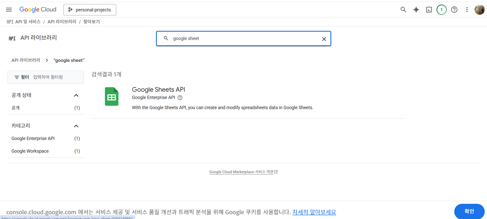

# 설치 메뉴얼

## Docker compose 실행

- 현재 프로젝트에서 Terminal 생성
- docker-compose up -d 명령어 실행
  - compose가 없는 경우 추천 명령어 확인해서 설치

## n8n 구성

- http://localhost:5678 접속
- 회원가입 및 설정 진행
  - 실제 사용하는 이메일로 설정
  - 이메일 쿠폰 확인 후 적용

## n8n 프로젝트 생성

## n8n 프로젝트 구성 불러오기

- 현재 경로에 있는 Woorifisa.json 파일 불러오기

## mongodb 연결

- [Mongodb](https://www.mongodb.com/cloud/atlas/register?utm_source=google&utm_campaign=search_pmax_pl_evergreen_atlas_general_prosp_gic-null_ww-multi_ps-all_dv-all_eng_lead&utm_term=&utm_medium=cpc_paid_search&utm_ad=&utm_ad_campaign_id=23331372646&adgroup=&cq_cmp=23331372646&gad_source=1&gad_campaignid=23327327279&gbraid=0AAAAADQ140335CDS9OdftO04s6ynJnWSS&gclid=Cj0KCQiAsY3LBhCwARIsAF6O6XiZiRBAhtub7vHXr7F1FP-VwOSLo9QGwSfQJwirfdU955YMea8iacIaAsaCEALw_wcB) 접속
- 회원가입
- 데이터베이스 클러스터 생성
- 데이터베이스 컬렉션 생성

## pinecone API 키 연결

- [pinecone](https://www.pinecone.io/) 접속
- 회원가입
- 데이터베이스 생성
- 인덱스 2개 생성(생성할 때 dimension 1024 설정 꼭 확인)
  - woorifisa-blogs
  - woorifisa-lectures
  - 
    
- api key 조회
  
- n8n credentials에 연결
  

## firecrawl API 키 연결

- [firecrawl](https://www.firecrawl.dev/) 접속
- 회원가입
- api key 조회
  
- n8n credentials에 연결
  

## openai API 키 연결

- [openai](https://platform.openai.com/settings)
- openai key 가져와서 n8n credentials에 연결
  

## 구글 시트 API 키 연결

- [google](https://console.cloud.google.com/)
  
